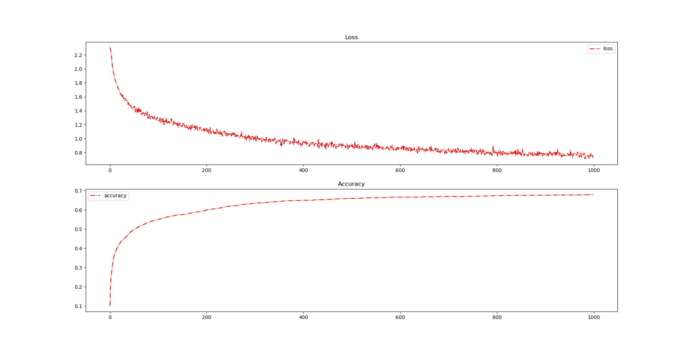

# 10-classification

## 环境

- win10
- python3.7.4
- pytorch==1.2.0+cu92
- torchvision==0.4.0+cu92

## 数据集

[http://www.cs.toronto.edu/~kriz/cifar.html](http://www.cs.toronto.edu/~kriz/cifar.html)

## 训练效果

使用GTX1070训练了100000个epoch的效果如下，约70%的识别准确率。

